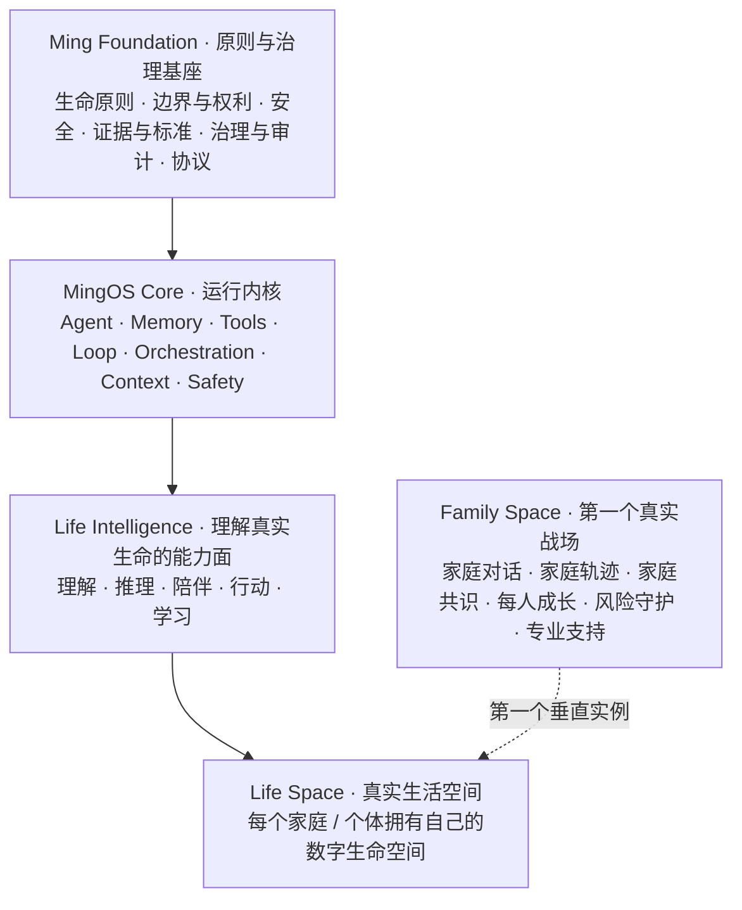

# MingOS 终局：把生命基础设施做成真实系统

> 接下来做的不是“三个仓库的开发”，而是在逐步把这个终局变成可以运行、可以验证、可以积累、最终可以留下来的真实系统。

## 我们最终要留下什么

MingOS 的终局不是一个家庭教育 AI、聊天机器人、Agent 平台或单一软件产品。

我们要建设的是一套**面向 AI 时代的生命基础设施**：让每一个人、每一个家庭拥有一个长期理解自己、守护安全、积累生命经验、支持成长，又不替自己活、不削弱主体性的智能空间。

最核心的一句话是：

> **不是让 AI 更像人，而是在越来越依赖 AI 的时代，帮助人仍然能够成为一个完整的人。**

因此，系统能力越强，人应当越自由、越能理解自己、越能判断并承担自己的选择，而不是越依赖 AI。

## 终局架构



这不是四个互相独立的产品，而是同一终局的四个层面：

- **Ming Foundation**：定义什么不可突破，负责生命原则、边界、安全、证据、标准、治理与协议。
- **MingOS**：把原则变成可运行的系统能力，负责 Agent、Memory、Tools、Loop、Orchestration、Context、Safety 等公共内核。
- **Life Intelligence**：不是独立产品，而是建立在内核之上的能力面——理解真实生命、形成判断、陪伴、行动并从反馈中学习。
- **Life Space**：人真正生活、选择、关系、成长和积累经验的空间；Family Space 是第一个垂直实例，但不是最终边界。

## 三仓关系

从工程职责看，三仓关系保持清晰：

```text
mingos-foundation  →  MingOS  →  Family-Space
原则与治理基座       公共运行内核    第一个真实垂直空间
```

从终局能力看，则是：

```text
Ming Foundation  →  MingOS  →  Life Intelligence  →  Life Space
                                                └→ Family Space（第一个实例）
```

Family Space 不需要承担整个终局定义；它负责在真实家庭场景里把终局跑起来、验证出来。

## 永远不变的底线

所有架构、功能、Agent、Memory、自动化和产品决策，都必须持续接受这些问题校准：

1. **生命优先**：生命不是待修复对象，不能把人压缩成问题、标签、分数或可优化变量。
2. **安全优先于成长**：存在明确生命安全风险时，安全机制优先。
3. **理解优先于干预**：先看见人、事实和局面，再决定是否介入。
4. **事实与解释分离**：未经确认的推断不能伪装成事实。
5. **主体性优先**：系统不能静默取得人的最终决定权，也不能替人活。
6. **最小可行一步**：只推进当下真实可承载的一步，而不是一次性交付“完美人生方案”。
7. **允许不知道**：承认未知、保留异议、持续学习，比假装确定更重要。
8. **透明与可控**：重要理解、授权、行动和证据应尽可能可解释、可审阅、可撤回、可退出。

Ming Foundation 是这些原则的规范性归宿；本文件是 MingOS 对终局的产品与系统层表达，不替代 Foundation 中的正式规范。

## Family Space 最终应积累什么

Family Space 的长期价值不是聊天记录本身，而是逐渐形成一个家庭自己的生命资产：

- Family Living Record：家庭长期生命轨迹；
- Family Intelligence：对家庭脉络、关系、状态和经验的持续理解；
- 家庭共识与价值边界；
- 事件、尝试、反馈、失败、有效经验与未知；
- 每个家庭成员自己的成长轨迹；
- 风险守护与专业支持的连续性。

目标不是“越来越懂用户，从而更容易控制和预测”，而是：

> **越来越懂你，但越来越少替你活。**

## 最终值得留下的资产

即使未来模型、界面、公司形态和具体代码全部变化，MingOS 仍希望留下：

- 一套可持续演化的生命智能基础协议；
- Ming Foundation 的生命原则、权利边界、安全、证据和治理体系；
- 一套真实世界案例、失败、反例与未知知识体系；
- 每个家庭 / 个体可拥有、可迁移、可控制的长期生命轨迹；
- 可验证、可审计、可持续学习的 Life Intelligence 系统；
- 一种让 AI 越强、人反而越自由的技术秩序。

## 开发判定尺

以后所有三仓开发都先回答两个问题：

> **这件事是否让我们更接近上述终局？**
>
> **它是在增强人的理解、自由与主体性，还是只是在让系统更聪明、更复杂、更可控？**

凡不能让终局更近的复杂度，应当被质疑、延后或删除。

凡让系统更强，却让生命更扁平、更依赖、更失去选择权的设计，应当被视为架构风险，而不是产品进步。
